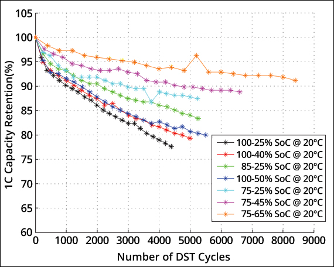

# SolarEdge Battery Control

## Introduction

This is a Python script designed for controlling the battery charging/discharging parameters and profiles/modes on SolarEdge inverters.

It uses the great [solaredge_modbus](https://github.com/nmakel/solaredge_modbus) library to access the SolarEdge inverter data (including the storage registers data). Thanks to [@herbi3](https://github.com/herbi3), the script `solaredge_modbus.py` has been extended from the original `solaredge_modbus` by the storage registers to support reading/writing to the storage control parameters which makes controlling the inverter charging/discharging behaviors possible. However, this comes with the [Limitations](#limitations) as there is still ongoing efforts to correctly implement these registers. Once they are implemented in the `solaredge_modbus` library, the script will be adjusted.

## What does it do?

Lithium-ion batteries age notably faster when having bigger DoD (depth of discharge). See the [Battery Life vs DoD](#battery-life-vs-dod-depth-of-discharge) below for more insight. 
Unfortunately, SolarEdge doesn't provide a way to limit the upper level of charge. One can only adjust the lower level by setting the percentage reserved for backup (so far power outages are nothing that happens daily yet...), but it can be done only manually and cannot be automated, based on a defined schedule. With this script it is possible to limit both the upper and the lower level of charge per defined period. Furthermore, it allows you eliminate the micro-charges by waiting for the battery to drop be a specified percentage before it starts charges again. Micro-charges are not as harmful as bigger DoD, but they don't bring as much benefit either Lastly with the script you can limit the charging current, based on the size of your battery. Generally lower current charges are better for the battery life. In the summer you have enough power to charge your battery slower. All these parameters can be adjusted for defined periods easily in a `YAML` configuration. For more details see the [configuration](#configuration) section.

## Battery Life vs DoD (Depth of Discharge)

According to this [study](https://batteryuniversity.com/article/bu-808-how-to-prolong-lithium-based-batteries) from [`Battery University`](https://batteryuniversity.com/) (other studies shows similar results), charging and discharging Lithium batteries only partially prolongs the battery life. The next table and graph are taken from the mentioned study and are for quick reference.

The below table estimates the number of discharge/charge cycles Li-ion can deliver at various DoD levels before the battery capacity drops to 70 percent. DoD constitutes a full charge followed by a discharge to the indicated state-of-charge (SoC) level in the table.

| Depth of Discharge | Discharge Cycles NMC | Discharge Cycles LiFePO4 | 
| :----------------: | :------------------: | :----------------------: |
| 100% DoD           | ~300                 | ~600                     |
| 80% DoD            | ~400                 | ~900                     |
| 60% DoD            | ~600                 | ~1,500                   |
| 40% DoD            | ~1,000               | ~3,000                   |
| 20% DoD            | ~2,000               | ~9,000                   |
| 10% DoD            | ~6,000               | ~15,000                  |

The below graph illustrates dynamic stress tests (DST) reflecting capacity loss when cycling Li-ion at various charge and discharge bandwidths. The largest capacity loss occurs when discharging a fully charged Li-ion to 25 percent SoC (black); the loss would be higher if fully discharged. Cycling between 85 and 25 percent (green) provides a longer service life than charging to 100 percent and discharging to 50 percent (dark blue). The smallest capacity loss is attained by charging Li-ion to 75 percent and discharging to 65 percent. This, however, does not fully utilize the battery. High voltages and exposure to elevated temperature is said to degrade the battery quicker than cycling under normal condition. [Nissan Leaf case](https://batteryuniversity.com/article/bu-808b-what-causes-li-ion-to-die)



- Case 1: 75–65% SoC offers longest cycle life but delivers only 90,000 energy units (EU). Utilizes 10% of battery.
- Case 2: 75–25% SoC has 3,000 cycles (to 90% capacity) and delivers 150,000 EU. Utilizes 50% of battery. (EV battery, new.)
- Case 3: 85–25% SoC has 2,000 cycles. Delivers 120,000 EU. Uses 60% of battery.
- Case 4: 100–25% SoC; long runtime with 75% use of battery. Has short life. (Mobile phone, drone, etc.)

## Requirements
The script requires Python 3.8.x. I've tested it with Python 3.11.4. A Python version manager like [PyEnv](https://github.com/pyenv/pyenv) is recommended.

## Installation & Run
- Clone the repository locally and go into its root folder

- If you use [PyEnv](https://github.com/pyenv/pyenv), you can install Python 3.11.4 with:
  ```sh
  pyenv install 3.11.4
  ```
  Use it as `global default` with `pyenv global 3.11.4` or `shell default` only for the current shell with `pyenv shell 3.11.1`. When using the latter option this of course needs to be executed for each newly opened shell.

- Create Python virtual environment:
  ```sh
  python -m venv venv
  ```
  
  Activate the virtual environment (it must be activated each time a new console is opened):
  ```sh
  # On MacOS / Linux
  source venv/bin/activate
  
  # On Windows for Command Prompt
  venv\Scripts\activate.bat
  
  # On Windows for PowerShell
  venv\Scripts\activate.ps1
  ```
  The creation of the python virtual environment must be done only once, when the repository is cloned but note that **it must be activated each time a new console is opened**.

- Verify whether the python virtual environment is properly activated:
  ```sh
  # Run it from the folder where your documentation repository is cloned
  pip --version
  ```
  It must point to the local repository and can be seen in the output:
  ```sh
  pip 23.1.2 from .../solaredge-battery-control/venv/lib/python3.11/site-packages/pip (python 3.11)
  ```

- You can install all the requirements with:
  ```sh
  pip install -r requirements.txt
  ```
- Before you run or schedule the script for the first time:
  [!IMPORTANT]  
  You need to set the `storage_contol_mode` to `4. Remote Control`, before you can change any of the `storage registers` and that they are considered by the inverter. Otherwise, they will have no effect at all. You can do enable the `Remote Control` by using the `--enable_storage_remote_control_mode` argument:
  ```sh
  python se_battery_control.py x.x.x.x --enable_storage_remote_control_mode
  ```
  Note that the above argument will also set the `storage_default_mode` to `7. Maximize self consumption`. If you would like a different one for the `storage_default_mode`, you can use the `--set_storage_default_mode <number>` argument. See below for argument help description or print it out with `--help`.

- You can use the following script to start/schedule the `se_battery_control.py` script.
  ```
  # For MacOS / Linux / Bash Shell under Windows
  run.sh
  ```

- Alternatively, of course you can start it manually:
  ```sh
  python se_battery_contro.py INVERTER_IP
  ```
  For list of all parameters use `--help`:
  ```console
  usage: se_battery_control.py [-h] [--port PORT] [--timeout TIMEOUT] [--unit UNIT] [--info] [--enable_storage_remote_control_mode]
                             [--set_storage_default_mode {0,1,2,3,4,5,7}]
                             host

  positional arguments:
    host                  Modbus TCP address

  options:
    -h, --help            show this help message and exit
    --port PORT           Modbus TCP port
    --timeout TIMEOUT     Connection timeout
    --unit UNIT           Modbus device address
    --info                Print all inverter settings
    --enable_storage_remote_control_mode
                          Set the "storage_contol_mode" to "4. Remote Control". Neccessary for the storage profiles to be considered. It must be done once. Check
                          the status with --info. Only after successful operation the script will work.
    --set_storage_default_mode {0,1,2,3,4,5,7}
                          Set the default storage charge / discharge default mode ("storage_default_mode"). Following options are available: 0. Off; 1. Charge from excess
                          PV power only; 2. Charge from PV first; 3. Charge from PV and AC; 4. Maximize export; 5. Discharge to match load; 7. Maximize self consumption.
                          When using the --enable_storage_remote_control_mode to enable the remote control of the storage control, the "storage_default_mode" is set to "7. Maximize self consumption".
  ```

## Configuration
The configuration of the script is located in the `config.yaml` file. The script can be configured to set different parameters according to the different periods defined into the configuration file. Each period can be minimum of 1 day. You can define as many periods as needed. As a template there are 11 periods defined for the "unpacked" seasons of the year.

It works like this: when the script is started it checks in which period the current day fits. Then it set the parameters to the inverter (only the values that are different from current ones).

Here is the list of the parameters and their description:

- `update_interval: 180`: Update interval if used as service / from the console
- `upper_charging_limit: 80`: Upper charging limit in %
- `soe_delta_charge: 10`: When the SOE drops by this amount of %, start charging again
- `backup_reserve: 10`: Charge in % reserved only for backup + SE Home Batteries 48V has 10% reserved energy which cannot be changed/used
- `charge_limit: 5000`: Battery maximum charge current in W
- `period_start: 1-Jan / period_end: 31-Dec`:  Star/End date for the periods. Note that the end date is inclusive. Months in Jan, Feb, Mar, Apr, May, Jun, Jul, Aug, Sep, Oct, Nov, Dec

You have first the `default_config` section which will be considered if the current day fits in none of the defined periods:
```yaml
defaul_config:
  update_interval: 180
  upper_charging_limit: 80
  soe_delta_charge: 10
  backup_reserve: 10
  charge_limit: 5000
```

Otherwise, if the current day fits in some of the defined periods, the values there will have a priority. Here is how the periods are defined:
```yaml
periods:
  # Hochwinter
  - period_start: 1-Jan
    period_end: 14-Feb
    config:
      upper_charging_limit: 90
      soe_delta_charge: 10
      backup_reserve: 10
      charge_limit: 5000
  
  # Spätwinter & Vorfrühling
  - period_start: 15-Feb
    period_end: 28-Mar
    config:
      upper_charging_limit: 80
      soe_delta_charge: 10
      backup_reserve: 10
      charge_limit: 5000
  ...
```

## Scheduling Script Runs
It is recommended for now to use it as `CronJob` due to its current [Limitations](#limitations).
However, you have the following 3 options to let the script run continually:
- As a `CronJob` (recommended): 
  Just use the provided `run.sh` script and adapts its parameters. You might want to use the `>/dev/null 2>&1d` to discard the console output of the script, so your `CronJob` logs not get too big. The script has its own log file (see [Troubleshooting & Logs](#troubleshooting--logs)). An example for running it each 3 min. would be:
  ```sh
  # SolarEdge Battery Control script
  */3 * * * /<path>/solaredge-battery-control/run.sh >/dev/null 2>&1d
  ```
- As a service: 
  To run it as a service, you must edit the `se_battery_control.py` script and adapt it at the end (e.g. disable the single run of `inverter_update_routine()` and enable the infinite loop afterwards).
  Afterwards you can set it up as a service with the `run.sh` script and `Systemd service`. Here is a short [guide](https://www.shubhamdipt.com/blog/how-to-create-a-systemd-service-in-linux/) how you can do it.
- In a [Tmux](https://github.com/tmux/tmux/wiki) session:
  Just run it as usually and **detach** from the session.

## Troubleshooting & Logs
The script generates a log files called `se_battery_control.log.*`. The log file size is limited to 5MB and maximum 20 log files are kept. This can be adjusted in the code if needed. The logging level can be adjusted from `LOGGER_LEVEL` variable in the script (default is `Info`).
When the script is started from the `console` it prints out the same information there as well as in the log file.

## Limitations
The current solution for adding the storage registers to the `solaredge_modbus` library by adding them as an additional Class with `Endian.Little` as `wordorder`, works most of the time. However, it fails when it changes the following registers `storage_control_mode`, `storage_default_mode` and `storage_backup_reserved_setting` the first attempt. On a second attempt it succeeds. It fails if you change the value to something different than currently set. Otherwise setting the value to the same always succeed. For this reason, a retry mechanism was implemented when writing these three registers with a delay between each retry to maximize the success rate as I observed that this helps. Anyway the `storage_control_mode` and `storage_default_mode` registers should be changed only once and the `storage_backup_reserved_setting`, quite seldom. The rest of the registers works fine without any issue.

In any case a cleaner solution is to be expected from the `solaredge_modbes` library and it's currently ongoing - check the open issue [Adding additional parameters](https://github.com/nmakel/solaredge_modbus/issues/36). Till then, I'm not aware of better alternative. I've tried the `Home Assistant` library, but with it the written values are also not properly encoded when writing and you end up in having totally different value in the registers.
